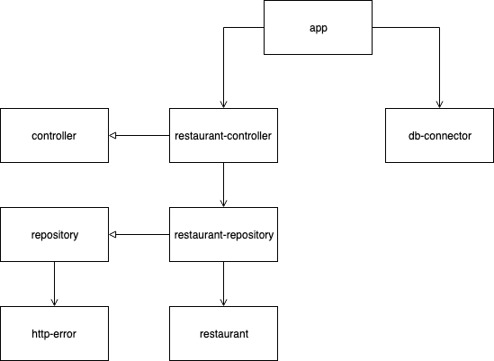

# How to Run
---
1. Clone or download the repository
2. `cd` in to the downloaded folder
3. Insert following commands: 
    - `docker-compose build`
    - `docker-compose up`
4. App is running on `http://localhost:3000`

---
## Class Diagram


---
### API
---
**Retrieve Restaurants**
---
* **URL** `http://localhost:3000/api/restaurants`
* **Method:** `GET`
* **Response:** 
```json
[
    {
        "name": "Tamarindo",
        "rating": 4.4,
        "photo": "https://cdn.pixabay.com/photo/2016/11/18/22/21/architecture-1837150_1280.jpg",
        "id": 0
    },
    {
        "name": "Paradiset Södermalm",
        "rating": 4.2,
        "photo": "https://cdn.pixabay.com/photo/2018/07/14/15/27/cafe-3537801_1280.jpg",
        "id": 1
    },
    ...
]
```

* **NOTE**: 
1. Sort restaurants by adding query parameters in the URL. For example, `http://localhost:3000/api/restaurants?sort=${any_attribute}&order=${asc OR desc}&limit=${number of restaurants}`
2. Search restaurants by adding query parameters in the URL. For example, `http://localhost:3000/api/restaurants?search=${name OR address OR phone_number OR opening_hours}`
---
**Retrieve a Restaurant**
---
* **URL** `http://localhost:3000/api/restaurants/{id}`
* **Method:** `GET`
* **Response:** 
```json
{
    "address": "Bällstavägen 36, 168 65 Bromma, Sweden",
    "phone_number": "070-733 11 28",
    "icon": "https://maps.gstatic.com/mapfiles/place_api/icons/restaurant-71.png",
    "name": "Bun Meat Bun",
    "price_level": 2,
    "rating": 4.3,
    "google_maps_url": "https://maps.google.com/?cid=106830997729029427",
    "website": "http://www.bunmeatbun.se/",
    "photo": "https://cdn.pixabay.com/photo/2018/07/14/15/27/cafe-3537801_1280.jpg",
    "id": 2,
    "location": {
        "lat": 59.36073769999999,
        "lng": 17.9548819
    },
    "opening_hours": [
        "Monday: 11:00 AM – 8:00 PM",
        "Tuesday: 11:00 AM – 8:00 PM",
        "Wednesday: 11:00 AM – 8:00 PM",
        "Thursday: 11:00 AM – 8:00 PM",
        "Friday: 11:00 AM – 8:00 PM",
        "Saturday: 12:00 – 8:00 PM",
        "Sunday: 12:00 – 8:00 PM"
    ]
}
```

---
**Create a Restaurant**
---
* **URL** `http://localhost:3000/api/restaurants`
* **Method:** `POST`
* **Headers:** `Content-Type: application/json`
* **Body:**
```json
{
    "address": "Bällstavägen 36, 168 65 Bromma, Sweden",
    "phone_number": "070-733 11 28",
    "icon": "https://maps.gstatic.com/mapfiles/place_api/icons/restaurant-71.png",
    "name": "Bun Meat Bun",
    "price_level": 2,
    "rating": 4.3,
    "google_maps_url": "https://maps.google.com/?cid=106830997729029427",
    "website": "http://www.bunmeatbun.se/",
    "photo": "https://cdn.pixabay.com/photo/2018/07/14/15/27/cafe-3537801_1280.jpg",
    "location": {
        "lat": 59.36073769999999,
        "lng": 17.9548819
    },
    "opening_hours": [
        "Monday: 11:00 AM – 8:00 PM",
        "Tuesday: 11:00 AM – 8:00 PM",
        "Wednesday: 11:00 AM – 8:00 PM",
        "Thursday: 11:00 AM – 8:00 PM",
        "Friday: 11:00 AM – 8:00 PM",
        "Saturday: 12:00 – 8:00 PM",
        "Sunday: 12:00 – 8:00 PM"
    ]
}
```
* **Response:** 
```json
{
    "address": "Bällstavägen 36, 168 65 Bromma, Sweden",
    "phone_number": "070-733 11 28",
    "icon": "https://maps.gstatic.com/mapfiles/place_api/icons/restaurant-71.png",
    "name": "Bun Meat Bun",
    "price_level": 2,
    "rating": 4.3,
    "google_maps_url": "https://maps.google.com/?cid=106830997729029427",
    "website": "http://www.bunmeatbun.se/",
    "photo": "https://cdn.pixabay.com/photo/2018/07/14/15/27/cafe-3537801_1280.jpg",
    "id": 2,
    "location": {
        "lat": 59.36073769999999,
        "lng": 17.9548819
    },
    "opening_hours": [
        "Monday: 11:00 AM – 8:00 PM",
        "Tuesday: 11:00 AM – 8:00 PM",
        "Wednesday: 11:00 AM – 8:00 PM",
        "Thursday: 11:00 AM – 8:00 PM",
        "Friday: 11:00 AM – 8:00 PM",
        "Saturday: 12:00 – 8:00 PM",
        "Sunday: 12:00 – 8:00 PM"
    ]
}
```
* **NOTE**: Only restaurant's name, address, and location attributes are required, others are optional.

---
**Update a Restaurant**
---
* **URL** `http://localhost:3000/api/restaurants/{id}`
* **Method:** `PUT`
* **Headers:** `Content-Type: application/json`
* **Body:**
```json
{
    "address": "Bällstavägen 36, 168 65 Bromma, Sweden",
    "phone_number": "070-733 11 28",
    "icon": "https://maps.gstatic.com/mapfiles/place_api/icons/restaurant-71.png",
    "name": "Bun Meat Bun",
    "price_level": 2,
    "rating": 4.3,
    "google_maps_url": "https://maps.google.com/?cid=106830997729029427",
    "website": "http://www.bunmeatbun.se/",
    "photo": "https://cdn.pixabay.com/photo/2018/07/14/15/27/cafe-3537801_1280.jpg",
    "location": {
        "lat": 59.36073769999999,
        "lng": 17.9548819
    },
    "opening_hours": [
        "Monday: 11:00 AM – 8:00 PM",
        "Tuesday: 11:00 AM – 8:00 PM",
        "Wednesday: 11:00 AM – 8:00 PM",
        "Thursday: 11:00 AM – 8:00 PM",
        "Friday: 11:00 AM – 8:00 PM",
        "Saturday: 12:00 – 8:00 PM",
        "Sunday: 12:00 – 8:00 PM"
    ]
}
```
* **Response:** 
```json
{
    "address": "Bällstavägen 36, 168 65 Bromma, Sweden",
    "phone_number": "070-733 11 28",
    "icon": "https://maps.gstatic.com/mapfiles/place_api/icons/restaurant-71.png",
    "name": "Bun Meat Bun",
    "price_level": 2,
    "rating": 4.3,
    "google_maps_url": "https://maps.google.com/?cid=106830997729029427",
    "website": "http://www.bunmeatbun.se/",
    "photo": "https://cdn.pixabay.com/photo/2018/07/14/15/27/cafe-3537801_1280.jpg",
    "id": 2,
    "location": {
        "lat": 59.36073769999999,
        "lng": 17.9548819
    },
    "opening_hours": [
        "Monday: 11:00 AM – 8:00 PM",
        "Tuesday: 11:00 AM – 8:00 PM",
        "Wednesday: 11:00 AM – 8:00 PM",
        "Thursday: 11:00 AM – 8:00 PM",
        "Friday: 11:00 AM – 8:00 PM",
        "Saturday: 12:00 – 8:00 PM",
        "Sunday: 12:00 – 8:00 PM"
    ]
}
```
* **NOTE**: Attributes that are in the request body will be updated, others will remain same. 

---
**Delete a Restaurant**
---
* **URL** `http://localhost:3000/api/restaurants/{id}`
* **Method:** `DELETE`
* **Response:** 
```json
{
    "address": "Bällstavägen 36, 168 65 Bromma, Sweden",
    "phone_number": "070-733 11 28",
    "icon": "https://maps.gstatic.com/mapfiles/place_api/icons/restaurant-71.png",
    "name": "Bun Meat Bun",
    "price_level": 2,
    "rating": 4.3,
    "google_maps_url": "https://maps.google.com/?cid=106830997729029427",
    "website": "http://www.bunmeatbun.se/",
    "photo": "https://cdn.pixabay.com/photo/2018/07/14/15/27/cafe-3537801_1280.jpg",
    "id": 2,
    "location": {
        "lat": 59.36073769999999,
        "lng": 17.9548819
    },
    "opening_hours": [
        "Monday: 11:00 AM – 8:00 PM",
        "Tuesday: 11:00 AM – 8:00 PM",
        "Wednesday: 11:00 AM – 8:00 PM",
        "Thursday: 11:00 AM – 8:00 PM",
        "Friday: 11:00 AM – 8:00 PM",
        "Saturday: 12:00 – 8:00 PM",
        "Sunday: 12:00 – 8:00 PM"
    ]
}
```
